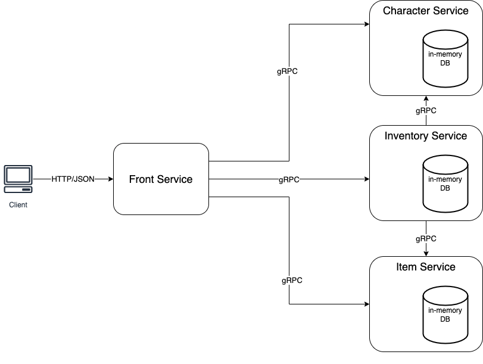

# Multiplayer Game microservice application using goa

This repo contains the code for a microservice application that stores characters and their item inventories for a
multiplayer game. The application is composed of the following microservices that communicate with each other:
- An HTTP/JSON front service which provides an API to manipulate the characters, their inventories, and the items that exist
- A GRPC back service that handles CRUD operations for the items that exist and their attributes
- A GRPC back service that handles CRUD operations for the characters and their attributes
- A GRPC back service that handles CRUD operations for the characters’ inventories

The diagram below represents the application's architecture.


## Getting Started

Build the binaries:
```bash
cd character
go build ./cmd/character && go build ./cmd/character-cli

cd ../inventory
go build ./cmd/inventory && go build ./cmd/inventory-cli

cd ../item
go build ./cmd/item && go build ./cmd/item-cli

cd ../front
go build ./cmd/front && go build ./cmd/front-cli
```

Start each server in a separate terminal:
```bash
./character/character
./inventory/inventory
./item/item
./front/front
```

Example of creating a character's inventory from a new terminal:
```bash
# create characters
./front/front-cli front create-character --body '{ "name": "link", "description": "savior of Princess Zelda", "health": 100, "experience": 10}'
./front/front-cli front create-character --body '{"name": "bazarack", "description": "antagonist", "health": 1000, "experience": 100}'
./front/front-cli front create-character --body '{"name": "bazarack", "description": "antagonist", "health": 1000, "experience": 100}' # you will get a "character already exists" error

# list characters
./front/front-cli front list-characters

# get a character
./front/front-cli front get-character --name "link"

# update a character
./front/front-cli front update-character --name "bazarack" --body '{"experience": 200}'

# create items
./front/front-cli front create-item --body '{"name": "potion", "description": "restores health", "healing": 20}'
./front/front-cli front create-item --body '{"name": "armor", "description": "reduces damage", "protection": 20}'
./front/front-cli front create-item --body '{"name": "sword", "description": "the legendary sword", "damage": 200, "protection": 100}'
./front/front-cli front create-item --body '{"name": "potion", "description": "restores health", "healing": 20}' # you will get a "item already exists" error 

# list items
./front/front-cli front list-items

# get an item
./front/front-cli front get-item --name "potion"

# update an item
./front/front-cli front update-item --name "armor" --body '{"protection": 50}'

# create character's inventory
./front/front-cli front add-inventory-item --character "link" --item "sword"
./front/front-cli front add-inventory-item --character "link" --item "potion"
./front/front-cli front add-inventory-item --character "bazarack" --item "armor"

# list character's inventory
./front/front-cli front get-inventory --character "link"
./front/front-cli front get-inventory --character "bazarack"

# remove from character's inventory
./front/front-cli front remove-inventory-item --character "link" --item "sword"

# delete an item
./front/front-cli front delete-item --name "sword"

# delete a character
./front/front-cli front delete-character --name "link"
```

Additionally, you can use the `--help` flag to get more info about the commands:
```bash
./front/front-cli front --help                                                                                                                                                                                                                                  ✔

The front service is the consumer facing API. It proxies the call to the backend services.
Usage:
    ./front/front-cli [globalflags] front COMMAND [flags]

COMMAND:
    create-character: Create a new character
    get-character: Get a character by name
    list-characters: List all characters
    update-character: Update a given character
    delete-character: Delete a given character
    create-item: Create a new item
    get-item: Get an item by name
    list-items: List all items
    update-item: Update a given item
    delete-item: Delete a given item
    add-inventory-item: Add an item to a character's inventory
    remove-inventory-item: Remove an item from a character's inventory
    get-inventory: Get a character's inventory

Additional help:
    ./front/front-cli front COMMAND --help
```
